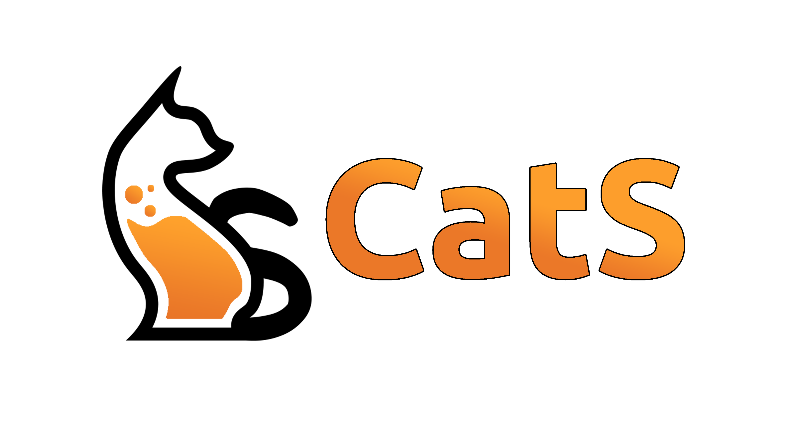

  

## Overview

  CatS is an open source framework that applies machine learning models, without programming requirements, in Heterogeneous Catalysis context. 
  
  For theoretical details, access our published article [here]().

## Installation

## Contributing
